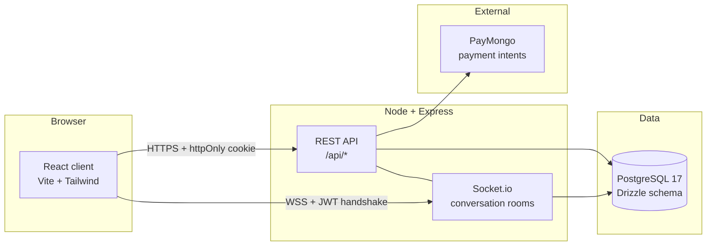

# Hilom

A multi-specialty healthcare marketplace for the Philippines: patients browse doctors by specialization, book slots, pay, chat, and receive prescriptions. Three roles — patient, doctor, admin — each with role-specific dashboards. Built mobile-first for users on LTE/3G and mid-range Android devices.

## Tech stack

| Layer             | Tools                                                                                                                             |
| ----------------- | --------------------------------------------------------------------------------------------------------------------------------- |
| Frontend          | React 18, Vite, TypeScript, Tailwind v4, shadcn/ui (Radix + CVA), React Router v6, Zustand, TanStack Query, React Hook Form + Zod |
| Backend           | Node.js, Express, TypeScript, Drizzle ORM, PostgreSQL 17, JWT (15m access + 7d refresh), Socket.io                                |
| Payments          | PayMongo (GCash, Maya, cards)                                                                                                     |
| Tooling           | Bun (package manager), Jest, Supertest, Husky, commitlint, ESLint, Prettier                                                       |
| Deploy (Phase 11) | Vercel (client) + Railway (server + Postgres)                                                                                     |

## Quickstart

Prerequisites: Bun ≥ 1.1, Node ≥ 20.19 (see `.nvmrc`), PostgreSQL 17 running locally.

```bash
# 1. Clone and install
git clone https://github.com/<your-handle>/hilom.git
cd hilom
bun install

# 2. Configure env
cp .env.example .env
# edit .env — set DATABASE_URL to your local Postgres

# 3. Push schema and seed specializations
bun run --filter server db:push
bun run --filter server db:seed

# 4. Run both apps (client on 5173, server on 4000)
bun run dev

# 5. Optional: local SMTP catcher for verification + reset emails
#    Web UI at http://localhost:1080
bunx maildev
```

To run only one workspace: `bun run --filter client dev` or `bun run --filter server dev`.

## Architecture



Auth flow: access token lives in a Zustand store (memory only — lost on refresh, by design). Refresh token is an httpOnly + secure + sameSite cookie. Every page load calls `/api/auth/refresh` to restore the session. On a 401, an Axios response interceptor silently refreshes via single-flight (one inflight refresh shared across concurrent 401s) and retries the original request.

## API documentation

Interactive Swagger UI is served at `/api/docs` (and the raw spec at `/api/openapi.json`). The OpenAPI document is generated from the same Zod schemas used at runtime, so it never drifts. Admin endpoints are filtered out of the public spec — admin middleware still enforces 403 on those routes.

Local: <http://localhost:4000/api/docs>. Production URL is wired up in Phase 11 (Railway deploy).

## Project structure

```
hilom/
├── client/             # React app (Vite)
│   └── src/
│       ├── app/        # router, providers
│       ├── components/ # ui/, layout/, forms/
│       ├── features/   # feature-folder modules (auth, ...)
│       ├── lib/        # cross-cutting utils, api client
│       └── pages/      # route-level pages
├── server/             # Express API
│   └── src/
│       ├── config/     # env, db, logger
│       ├── controllers/
│       ├── db/         # drizzle schema + seed
│       ├── middleware/
│       ├── routes/
│       ├── schemas/    # zod request schemas
│       └── utils/
├── phases.md           # 11-phase roadmap
└── CLAUDE.md.local     # engineering rules (Type Safety, Module Hygiene, Security, etc.)
```

## Phase status

See [phases.md](phases.md). Currently shipping **Phase 2.5 — Operational Foundation**.

## License

[MIT](LICENSE)
