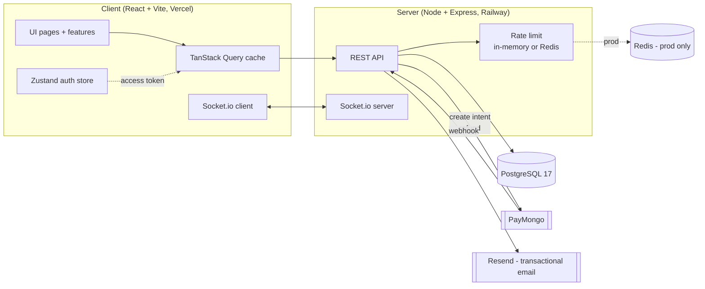
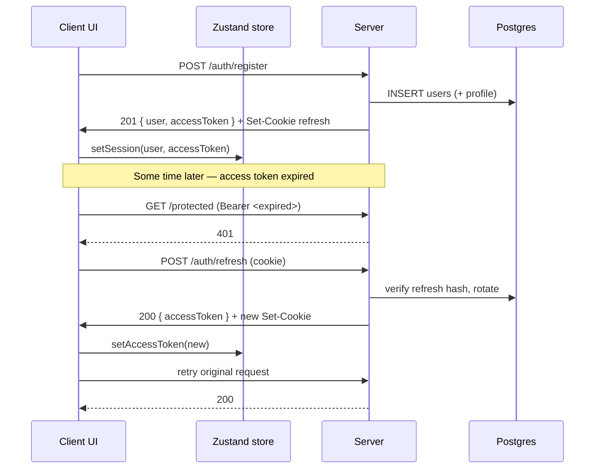
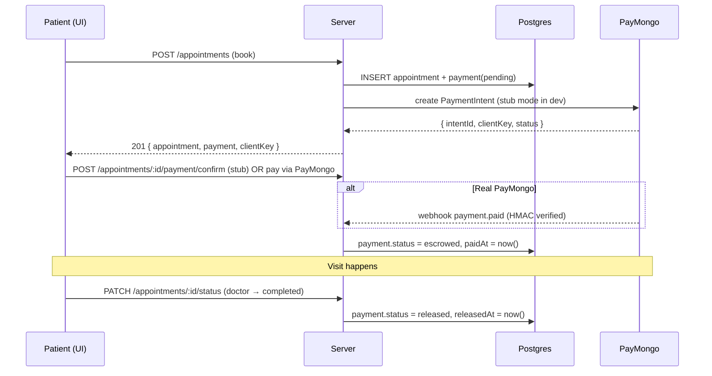

# Architecture

## System

Notes:

- Access token lives in memory (Zustand). Refresh token is an httpOnly,
  secure, sameSite=strict cookie.
- Socket.io reuses the access token via the handshake `auth.token` field;
  emits go to per-user rooms (`user:<userId>`).
- Rate limiter is in-memory in dev/test; Redis-backed in production
  (multi-instance safe).

## Auth flow

Reuse detection: if a refresh token is presented twice, the server
clears `users.refresh_token_hash` (forces logout everywhere).

## Payment flow

Cancel branch: PATCH status → `cancelled`. If payment was `escrowed` or
`released`, server calls PayMongo refund + flips payment to `refunded`.
If payment was still `pending`, the row is closed out as `refunded` with
no PayMongo call (nothing was charged).
